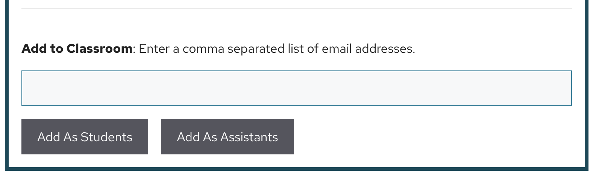

# Add TAs/Co-Instructors

If you have TAs or Co-instructors, you may wish to give them permission to manage portions of your course in the database. Otherwise, you may skip this step.

TAs and co-instructors have the same permissions as lead instructors, except they cannot create classes/sections or manage other TAs/co-instructors. They can add students to their classes/sections, see student database entries in their classes/sections, and edit, delete, and finalize those database entries.

To add TAs/co-instructors:

1. Instruct your TAs/co-instructors to create database accounts, following the same process and using the same Invitation Code as your students. We recommend you share the [Getting Started](register.md) page of this guide with your TAs, as it explains the process to them. If you do not have a valid Invitation Code to give your TAs/co-instructors, please contact <tinyearth@wid.wisc.edu>
2. Once your TAs/co-instructors have made their accounts, visit [Manage Classes](https://discovery.tinyearth.wisc.edu/classroom-management/)
3. If you have multiple classes or sections, select the class/section you want to add TAs/co-instructors to from the dropdown
4. Under "Add to Classroom," enter the email addresses your TAs/co-instructors used to create their accounts, separated by commas
5. Click "Add as Assistants"

!!! note ""
    

You should now see your TAs/co-instructors listed on your course as Assistants. If there were any errors adding their accounts (usually from an incorrect email address), a message will be displayed at the top of the screen.

Your TAs/co-instructors will now see a [Manage Classes](https://discovery.tinyearth.wisc.edu/classroom-management/) tab on their view of the database as well.

The remaining steps of this guide can now be completed by either you or your TAs/co-instructors.
