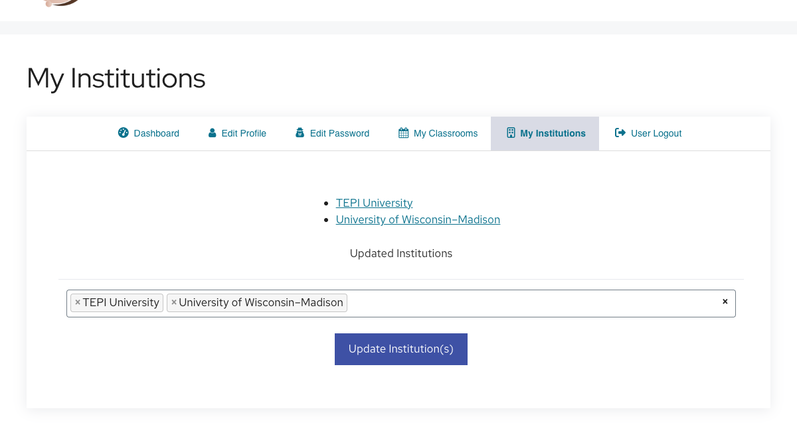

# Setting Up Your Instructor Account

The first time you login with your instructor account, before you create your first class, you will need to [set your institution(s)](https://discovery.tinyearth.wisc.edu/my-account/my-institutions/).

All TEPI institutions should be listed already, but if yours is not, please contact <tinyearth@wid.wisc.edu> to have it added.

!!! note ""
    

!!! tip "Recommended: Practice with TEPI University"
    The institution named "TEPI University" is a special case.

    When we conduct trainings and webinars, we add trainees to a classroom in "TEPI University," and any data created in that class is considered test data and will not be uploaded to the public-facing database.

    We recommend adding/keeping "TEPI University" as an institution on your account so you can create test classrooms of your own to practice database functions in.

Instructors

If you already have an account that has student access but not instructor access, such as from a webinar or training, please reach out to tinyearth@wid.wisc.edu to have your account promoted.

If you do not already have an account, but were given an Instructor Invitation Code, please follow the instructions above using your instructor Invitation Code.

Otherwise, please reach out to tinyearth@wid.wisc.edu to receive a code and setup instructions.

!!! warning "New Account? Wait for Test Classroom Access!" After instructor accounts are created, they are manually added to a test classroom in the "TEPI University" institution, allowing instructors to experiment with database features.

If you have just created an instructor account, have patience as we add you to the test classroom. We will notify you when complete, and you may then continue to the next step of the guide, [adding your first entry](first-entry.md)
If you have problems or questions, reach out to tinyearth@wid.wisc.edu
