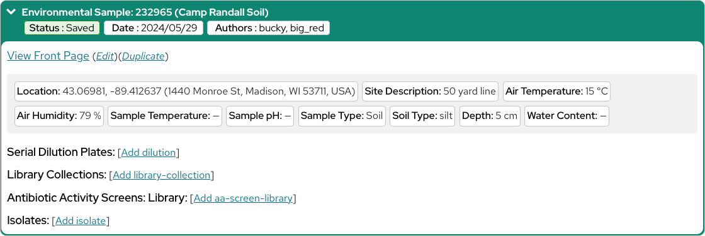
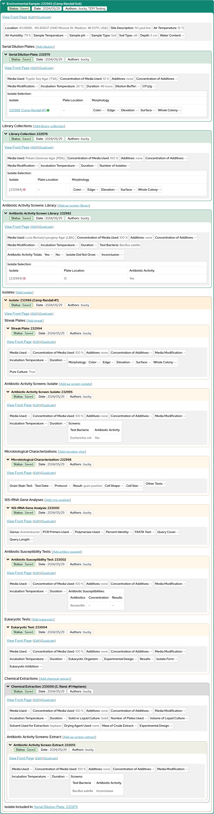

# My Entries

The [My Entries](https://discovery.tinyearth.wisc.edu/my-entries/) page is your one stop shop for all entries you could want to add to the Discovery Database and to see the relationships between them.

And now that you've added your first Environmental Sample, when you return to your [My Entries](https://discovery.tinyearth.wisc.edu/my-entries/) page, you should now see your Sample listed, as a green box that can be expanded.

!!! note ""
    

Within your Sample's box, you can see the information you recorded, as well as a number of actions you can take:

- View the entry's "Front Page," which we will talk about later in this guide
- Edit the entry's details
- Create a duplicate of the entry for when you need a new entry similar to an old one
- And add new, different kinds of entries that reference this entry, such as Serial Dilution Plates and Isolates. More information about the various types of database entries are described in the [Entry Types](entries/index.md) section of this guide

Throughout your Tiny Earth course, as you create additional entries and return to this page, you will notice that the boxes shown expand to illustrate which entries "contain," or are referenced by, which other entries. This can help you locate entries you are working with and visualize their relationships.

!!! note ""
    

!!! tip "Recommended: Review Entry Types Pages as Needed"
    This guide is kept lightweight so that you can contribute to science faster.

    You are not expected to be an expert on all thirteen database entry types before you begin -- And in a single class you almost certainly won't use them all!

    Instead, keep the [Entry Types](entries/index.md) portion of this guide handy and consult it as necessary.

So far, you've only added one Environmental Sample. Let's pause and plan what data you'll add throughout the rest of your research plan, and what order will be the most well-suited for you!
