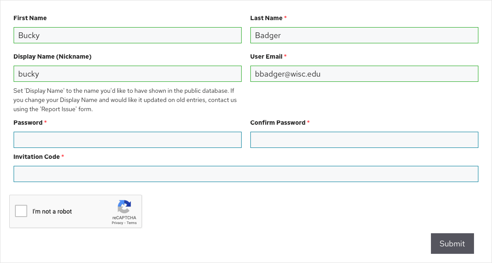

# Getting Started

To get started, you will need to create an account on the [Discovery Database](https://discovery.tinyearth.wisc.edu/).

Students and Teaching Assistants create their accounts on the [Discovery Database](https://discovery.tinyearth.wisc.edu/) website, then are added to their course by the instructor.

Instructors accounts have higher permissions, and are either (a) created as a student account during a training, webinar, or workshop and then promoted to an instructor account, or (b) created using an Instructor Invitation Code without going through a training first. Please contact <tinyearth@wid.wisc.edu> for assistance and questions.

## Students, Teaching Assistants, and Co-Instructors

1. Visit <https://discovery.tinyearth.wisc.edu/registration/>
2. Complete the form, filling in your name, display name, and email. Create a password you will use to log into the database, and input the Invitation Code you were given by your course's lead instructor
3. Submit the form and await an activation email
4. Click the link in the activation email to finish creating your account. Please click the activation link **within 24 hours**. If you encounter errors setting up your account or logging in, please contact us using the [Report Issue](https://discovery.tinyearth.wisc.edu/report-issue/) form
5. Notify your instructor or TA that your account is complete so they can add you to their course
6. Once you've been added to the course, visit <https://discovery.tinyearth.wisc.edu/> and log in -- let's begin! Continue to the next step of the guide, [adding your first entry](first-entry.md)

!!! note ""
    

## Lead Instructors

If you already have an account that has student access but not instructor access, such as from a webinar or training, please reach out to <tinyearth@wid.wisc.edu> to have your account promoted.

If you do not already have an account, but were given an Instructor Invitation Code, please follow the instructions above using your Instructor Invitation Code. Instructor Invitation Codes can be found on the TEPI website -- just click "Tiny Earth Database" on the TEPI homepage.

If you need help, have problems, or have questions, please reach out to <tinyearth@wid.wisc.edu>.

!!! warning "Want access to a test classroom?"
    If you want a test classroom where you and your TAs/co-instructors can experiment with database features, follow these steps:

    1. Once you've created your account, [add "TEPI University" as one of your institutions](instructor-setup.md)
    2. Then [create a class](first-classroom.md), setting "TEPI University" as the class's institution. All data from "TEPI University" is considered fake
    3. Once you've made your test classroom, you can use it to, for example, practice [adding entries](first-entry.md), [adding TAs/co-instructors](assistants.md), [adding students](students.md), and more!
